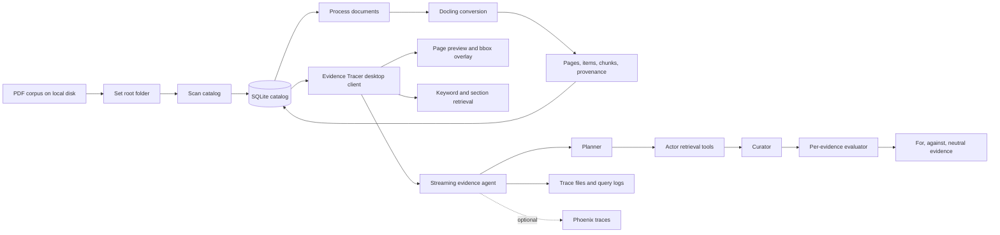

# Evidence Tracer

Local-first document intelligence workspace for scanning PDF corpora, extracting page-aware structure with Docling, and tracing answers back to precise source evidence from a desktop UI.

Evidence Tracer is organized as a desktop-first research workbench: the backend owns extraction, cataloging, retrieval, and trace artifacts; the Tauri client provides an interactive reading surface for corpus selection, page inspection, bounding-box overlays, processing progress, and streaming agentic retrieval runs.

## Demo


https://github.com/user-attachments/assets/1a425cc3-16fe-4baa-9398-3ca48d6da2c3


## Overview

Evidence Tracer is built for careful document analysis over local PDFs. It keeps source files on disk, stores derived structure in a local SQLite database, and exposes retrieval results with document, page, chunk, item, and bounding-box locators where available.

The retrieval loop is meant to mimic a human style of document review: start from a primary document, inspect relevant sections, tables, and figures, follow citations into related documents, curate only evidence that can be traced back to source locations, then classify each accepted evidence item as supporting, refuting, or neutral for the user's query.

Core capabilities:

- Discover PDFs under a selected root folder and track new, stale, missing, and processed files.
- Convert PDFs through Docling into pages, document items, hierarchical chunks, table/figure metadata, and page provenance, with streamed batch progress for long processing runs.
- Render cached page previews for visual inspection and overlay chunk bounding boxes in the client.
- Search processed chunks and navigate table-of-contents sections.
- Run a LangGraph/Ollama evidence agent that plans retrieval tasks, executes document tools, follows citation-led multi-hop paths from one selected document, curates evidence, evaluates accepted evidence as for, against, or neutral, streams progress, and writes trace artifacts.
- Tune the run-wide evidence task budget from the desktop UI while backend safety caps protect long-running searches.
- Optionally send OpenTelemetry traces to Phoenix for observability.

## Workflow



The typical loop is:

1. Choose a root PDF folder in the desktop client.
2. Scan the folder to register or refresh catalog records.
3. Process new or stale PDFs through Docling.
4. Inspect page previews, chunks, and structured items.
5. Set a task cap and ask an evidence question against one selected document.
6. Review streamed tasks, accepted evidence grouped into For, Against, and Neutral categories, source locations, and trace artifacts.

Current multi-hop behavior starts from exactly one selected document. During a run, the agent can follow citations and references into other processed documents when the reference text can be resolved against the local catalog.

## Current Format Assumptions

Evidence Tracer is a research demo built in a short timeframe. It has not yet been thoroughly tested across a broad range of document types, layouts, or quality levels, and further testing and improvements are likely necessary before it can be a robust product.

Evidence Tracer is currently optimized for technical PDF sets with recognizable table-of-contents structure, section headings, numbered references or citations, and stable table/figure captions. Those conventions are what make section navigation, citation resolution, and multi-hop evidence tracing work well.

Other document families can still be scanned, processed, viewed, and searched, but citation-led multi-hop review will likely need adaptation for different TOC layouts, reference formats, citation styles, heading conventions, cross-document naming patterns, or non-PDF formats.

## Known Limitations and Future Work

The following areas would be good next tasks for anyone continuing the project:

- Add broader regression testing across different PDF layouts, document quality levels, citation styles, and corpus sizes.
- Support additional file formats beyond PDFs, and formats that do not expose page structure, TOC entries, or conventional citation metadata.
- Improve document title resolution so the catalog does not rely primarily on file names. Possible signals include PDF metadata, extracted cover-page titles, first-page headings, and normalized reference-list titles.
- Improve cross-document reference resolution for different citation styles, including numbered citations, author-year citations, footnotes, legal-style references, and inconsistent bibliography formatting.
- Let the agent inspect the titles of all files in a selected folder or corpus before deciding which TOC or document sections to read. This would reduce dependence on citation traversal from a single starting file.
- Add corpus-level discovery tasks so the agent can choose promising documents directly from catalog metadata, titles, folder context, and search results rather than only following references from the selected document.
- Improve agent prompts for planning, tool selection, evidence curation, stance evaluation, and stopping behavior.
- Remove redundant actor calls for tasks that can be handled with direct deterministic tool use.
- Add evaluation fixtures and tests for multi-hop retrieval quality, citation resolution accuracy, evidence stance classification, and source locator correctness.
  
## Repository Layout

```text
.
|-- backend/
|   |-- app/
|   |   |-- api/routes/          # FastAPI route modules
|   |   |-- core/                # settings, SQLite setup, observability
|   |   |-- pipelines/           # Docling PDF processing pipeline
|   |   |-- services/            # catalog, processing, PDF, evidence agent
|   |   |-- tests/               # backend unittest suite
|   |   `-- utils/               # shared records, bbox, JSON helpers
|   |-- data/                    # local generated state, gitignored
|   |-- pyproject.toml
|   `-- uv.lock
|-- tauri-app/
|   |-- src/                     # React UI
|   |-- src-tauri/               # Rust Tauri host
|   |-- package.json
|   `-- package-lock.json
`-- README.md
```

## System Components

### Backend

The backend is a FastAPI service under `backend/app`. It initializes SQLite at startup, exposes the document and evidence APIs, and stores generated state under `backend/data/`.

Important modules:

- `backend/app/api/routes/workspace.py` - root-folder configuration, scan, and tree APIs.
- `backend/app/api/routes/documents.py` - document listing, processing, page bundles, preview images, and source PDF serving.
- `backend/app/api/routes/evidence.py` - TOC navigation, keyword search, and agentic retrieval endpoints.
- `backend/app/services/catalog_service.py` - SQLite catalog operations and source-of-truth persistence.
- `backend/app/services/processing_service.py` - per-document and batch processing orchestration.
- `backend/app/pipelines/docling_pipeline.py` - Docling conversion into page, item, chunk, and summary records.
- `backend/app/services/evidence_service.py` - retrieval tools, source locators, trace files, stance counts, and API response finalization.
- `backend/app/services/evidence_agent.py` - LangGraph planner/actor/curator/evaluator loop over Ollama.

Generated backend state:

- `backend/data/catalog.sqlite3` - document catalog, pages, items, chunks, and chunk-page mappings.
- `backend/data/page_previews/` - cached rendered PNG page images.
- `backend/data/retrieval_traces/` - readable traces, JSON traces, model inputs/outputs, and tool logs.
- `backend/data/retrieval_query_results.jsonl` - append-only query result log.

### Desktop Client

The desktop client is a React + Tauri app under `tauri-app/`.

It supports:

- Backend URL configuration, persisted in browser storage.
- Root path entry and catalog scan/process actions with streamed progress.
- Folder/document tree navigation.
- Page list and page jump navigation.
- Page image preview with chunk bounding-box overlays.
- Chunk text inspection and source PDF opening.
- Streaming evidence retrieval via `/evidence/run/stream`, including a configurable run task cap, live For/Against evidence columns, a Neutral evidence list, and hoverable relevance and stance rationale notes.

## Getting Started

### Prerequisites

- Python 3.12 or newer.
- `uv` for backend dependency management.
- Node.js and npm.
- Rust toolchain for Tauri.
- Optional for evidence-agent runs: Ollama serving `qwen3:latest` at `http://127.0.0.1:8880`.
- Optional for tracing: Phoenix collector at `http://127.0.0.1:6006/v1/traces`.

### 1. Install Backend Dependencies

```bash
cd backend
uv sync
```

### 2. Start the Backend

```bash
cd backend
uv run uvicorn app.main:app --reload
```

The API serves at `http://127.0.0.1:8000`.

Check it with:

```bash
curl http://127.0.0.1:8000/health
```

### 3. Install Frontend Dependencies

```bash
cd tauri-app
npm install
```

### 4. Run the Desktop App

```bash
cd tauri-app
npm run tauri dev
```

Use the native desktop window for the full app experience. The Vite browser preview is useful for layout work, but desktop-only APIs such as native dialogs are only available in the Tauri runtime.

For browser-only UI development:

```bash
cd tauri-app
npm run dev
```

## Evidence Agent Setup

Agentic retrieval uses a local Ollama chat model through LangChain and LangGraph. The current defaults are defined in `backend/app/core/config.py`:

- Ollama base URL: `http://127.0.0.1:8880`
- Ollama model: `qwen3:latest`
- API request default: `max_tasks = 32`
- Safety caps: `agent_max_tasks = 250`, `agent_max_tool_calls = 250`, `agent_max_evidence = 250`, `agent_max_graph_steps = 800`

Prepare the model before running `/evidence/run` or `/evidence/run/stream`:

```bash
ollama pull qwen3:latest
```

If Ollama is not reachable or the model is missing, the backend returns a `503` with the preflight error.

Agentic retrieval currently requires one starting document in the request. From there, it can inspect sections, search chunks and structured items, and resolve citations into related processed documents when the source corpus uses compatible reference conventions. As the curator accepts evidence, a separate evaluator classifies each item as `for`, `against`, or `neutral`; the final response includes the raw evidence plus an `analysis` summary with supporting, refuting, and neutral chunk counts.

## Observability

Phoenix tracing is enabled by default when the Phoenix OpenTelemetry package can register successfully. The backend reads these environment variables:

| Variable | Default | Meaning |
| --- | --- | --- |
| `PHOENIX_ENABLED` | `true` | Set to `false`, `0`, `no`, or `off` to disable tracing. |
| `PHOENIX_PROJECT_NAME` | `evidence-tracer` | Phoenix project name. |
| `PHOENIX_COLLECTOR_ENDPOINT` | `http://127.0.0.1:6006/v1/traces` | OTLP HTTP trace endpoint. |

Start Phoenix in a separate terminal before running agentic retrieval:

```bash
uvx --from arize-phoenix phoenix serve
```

Then open the Phoenix UI in a browser:

```text
http://127.0.0.1:6006
```

The browser address is the Phoenix UI. The backend sends spans to the OTLP traces endpoint at `http://127.0.0.1:6006/v1/traces`. With the default settings, start the backend normally and run an evidence query; LangChain/LangGraph/Ollama spans should appear in the `evidence-tracer` Phoenix project.

```bash
cd backend
uv run uvicorn app.main:app --reload
```

Example with tracing disabled:

```bash
cd backend
PHOENIX_ENABLED=false uv run uvicorn app.main:app --reload
```

## API Map

| Area | Method and path | Purpose |
| --- | --- | --- |
| Health | `GET /health` | Return backend status, version, root path, and database path. |
| Workspace | `GET /config` | Read configured root path. |
| Workspace | `PUT /config/root` | Set the active PDF root folder. |
| Workspace | `POST /scan` | Recursively scan the active or supplied root folder for PDFs. |
| Workspace | `GET /tree` | Return a folder/document tree for the current root. |
| Documents | `GET /documents` | List cataloged documents, optionally filtered by status. |
| Documents | `GET /documents/query` | Query documents, chunks, and items. |
| Documents | `GET /documents/{document_id}` | Fetch one document record. |
| Documents | `POST /documents/process` | Process selected, stale, or all eligible documents. |
| Documents | `POST /documents/process/stream` | Stream batch processing progress and final results as newline-delimited JSON. |
| Documents | `POST /documents/{document_id}/process` | Process one document. |
| Documents | `GET /documents/{document_id}/pages` | List page summaries for a document. |
| Documents | `GET /documents/{document_id}/pages/{page_number}` | Fetch page chunks and overlay data. |
| Documents | `GET /documents/{document_id}/pages/{page_number}/image` | Render or serve a cached PNG page preview. |
| Documents | `GET /documents/{document_id}/file` | Serve the source PDF. |
| Evidence | `GET /evidence/documents/{document_id}/toc` | Return readable TOC entries from section headers. |
| Evidence | `GET /evidence/documents/{document_id}/sections` | Navigate to the best matching section. |
| Evidence | `GET /evidence/search` | Run keyword retrieval over processed chunks. |
| Evidence | `POST /evidence/run` | Run agentic retrieval and return the final response. |
| Evidence | `POST /evidence/run/stream` | Stream agentic retrieval as newline-delimited JSON. |

## Minimal API Walkthrough

```bash
curl -X PUT http://127.0.0.1:8000/config/root \
  -H 'Content-Type: application/json' \
  -d '{"root_path": "/absolute/path/to/pdfs"}'
```

```bash
curl -X POST http://127.0.0.1:8000/scan \
  -H 'Content-Type: application/json' \
  -d '{}'
```

```bash
curl -X POST http://127.0.0.1:8000/documents/process \
  -H 'Content-Type: application/json' \
  -d '{"only_stale": true}'
```

For long batches, use the streaming endpoint:

```bash
curl -N -X POST http://127.0.0.1:8000/documents/process/stream \
  -H 'Content-Type: application/json' \
  -d '{"only_stale": true}'
```

```bash
curl 'http://127.0.0.1:8000/evidence/search?q=thermal&limit=5'
```

```bash
curl -X POST http://127.0.0.1:8000/evidence/run \
  -H 'Content-Type: application/json' \
  -d '{"query": "What evidence supports the selected document?", "document_ids": [1], "max_tasks": 32}'
```

Agentic retrieval currently starts from exactly one selected document. The service can follow references and search related processed documents during the run.

## Development Commands

Backend:

```bash
cd backend
uv sync
uv run uvicorn app.main:app --reload
uv run python -m unittest discover app/tests -v
```

Frontend:

```bash
cd tauri-app
npm install
npm run dev
npm run build
```

Tauri host:

```bash
cd tauri-app/src-tauri
cargo test
```

## Verification

Use these commands before opening a pull request or sharing a result:

```bash
cd backend
uv run python -m unittest discover app/tests -v
```

```bash
cd tauri-app
npm run build
```

```bash
cd tauri-app/src-tauri
cargo test
```

The repository does not currently define a Python coverage threshold or a frontend test runner beyond the TypeScript/Vite build.

## Data and Reproducibility Notes

- Source PDFs are not copied into the repository; the configured root path points to files on local disk.
- `backend/data/` is generated runtime state and is intentionally gitignored.
- Processing is deterministic with respect to the installed dependency versions and source PDFs, but Docling and OCR/layout behavior can change when dependencies are upgraded.
- Retrieval traces are local artifacts intended for debugging and evaluation. They may include excerpts from processed documents, so treat them as sensitive when working with private corpora.
- Lockfiles are part of the reproducibility story: keep `backend/uv.lock`, `tauri-app/package-lock.json`, and `tauri-app/src-tauri/Cargo.lock` in sync with dependency changes.

## Documentation

- `backend/README.md` - backend-specific setup, endpoints, and storage notes.
- `tauri-app/README.md` - desktop-client setup, runtime expectations, and development commands.

## License

This repository is licensed under the terms in `LICENSE`.
